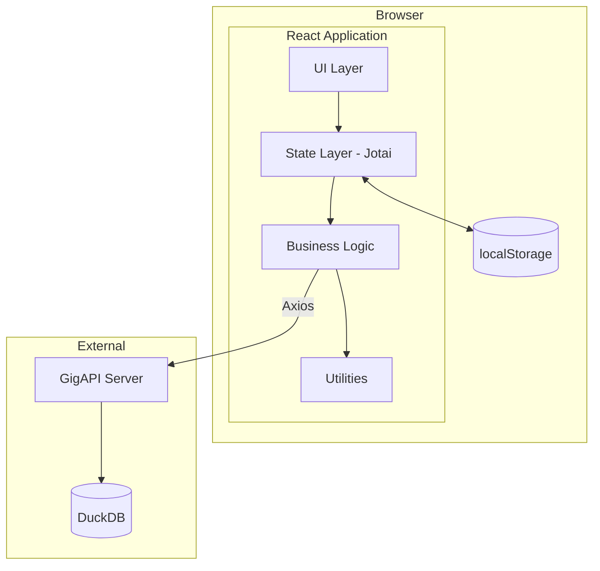
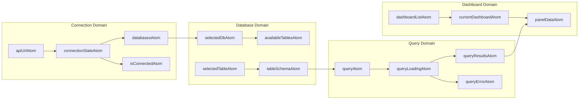
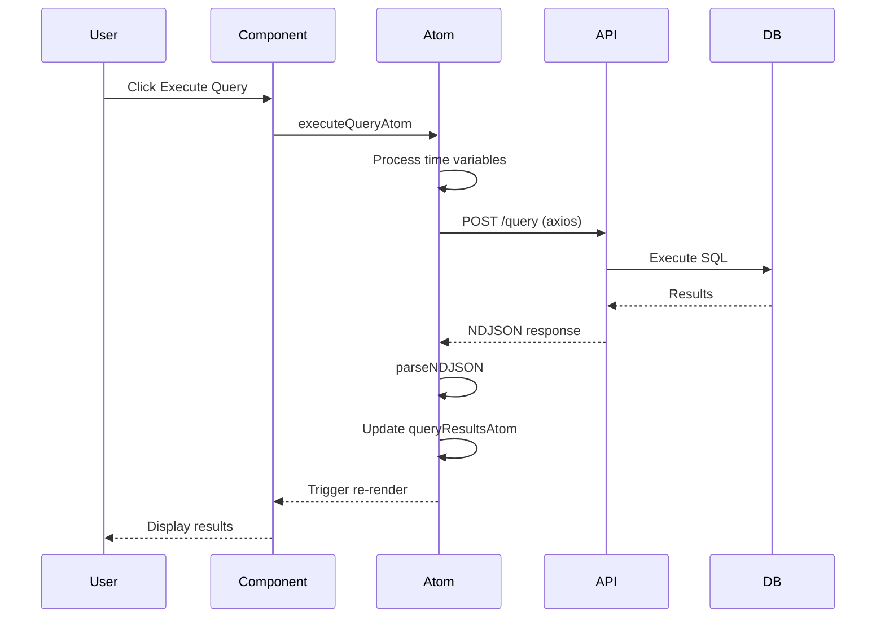
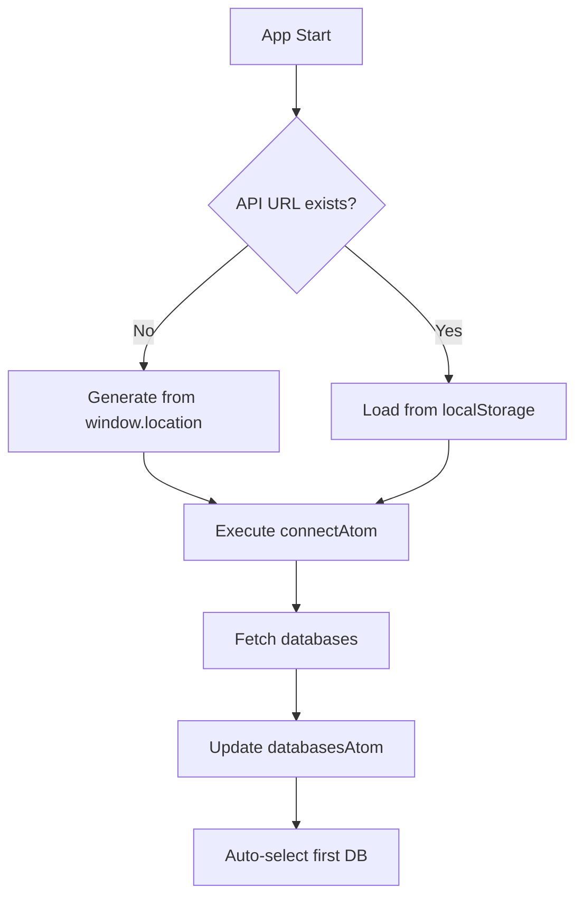
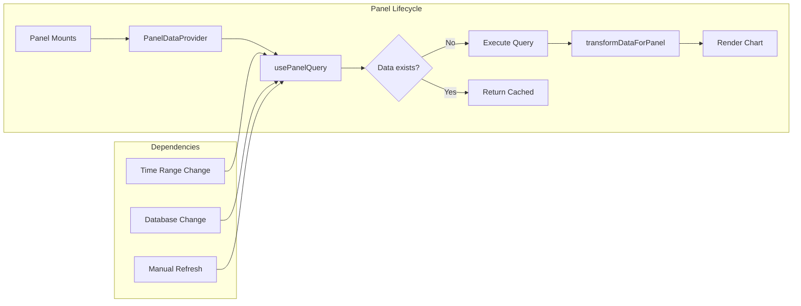
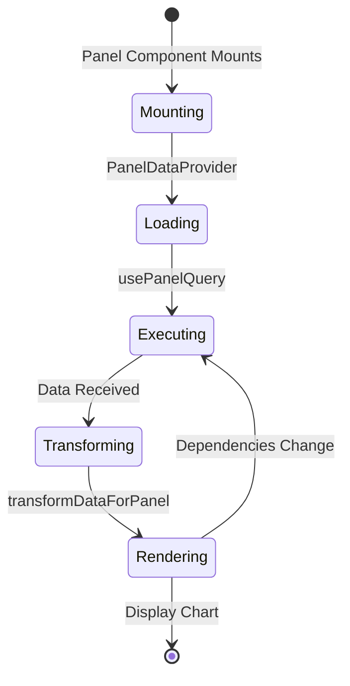

# GigAPI UI - Complete Architecture Documentation

## Table of Contents
1. [Overview](#overview)
2. [Architecture Diagrams](#architecture-diagrams)
3. [State Management with Jotai](#state-management-with-jotai)
4. [Data Flow Patterns](#data-flow-patterns)
5. [Component Architecture](#component-architecture)
6. [Query Processing Pipeline](#query-processing-pipeline)
7. [Dashboard System](#dashboard-system)
8. [API Communication](#api-communication)
9. [Critical Implementation Notes](#critical-implementation-notes)
10. [Performance Optimizations](#performance-optimizations)
11. [Common Patterns & Best Practices](#common-patterns--best-practices)

## Overview

GigAPI UI is a React-based web application for querying and visualizing time-series data. It uses:
- **React 19** with TypeScript
- **Vite** for build tooling
- **Jotai** for state management (fully migrated from React Context)
- **Axios** for all HTTP requests
- **E-CHARTS** for data visualization
- **Monaco Editor** for SQL editing
- **shadcn/ui** with Tailwind CSS v4 for UI components

## Architecture Diagrams

### High-Level Architecture



### Jotai Atom Architecture



### Data Flow Sequence



## State Management with Jotai

### Atom Types and Patterns

#### 1. Base Atoms (Primitive State)

```typescript
// Simple atom with localStorage persistence
export const apiUrlAtom = atomWithStorage<string>("gigapi_api_url", "", {
  getItem: (key) => localStorage.getItem(key) || "",
  setItem: (key, value) => localStorage.setItem(key, value),
  removeItem: (key) => localStorage.removeItem(key),
});

// Runtime state (not persisted)
export const connectionStateAtom = atom<ConnectionState>("disconnected");
```

#### 2. Derived Atoms (Computed State)

```typescript
// Read-only atom derived from other atoms
export const isConnectedAtom = atom(
  (get) => get(connectionStateAtom) === "connected"
);

// Available database names from database objects
export const availableDatabasesAtom = atom((get) => {
  const databases = get(databasesAtom);
  return databases.map(db => db.database_name || db.name);
});
```

#### 3. Action Atoms (Side Effects)

```typescript
// Write-only atom for async operations
export const connectAtom = atom(
  null,
  async (get, set, url: string) => {
    set(connectionStateAtom, "connecting");
    try {
      const response = await axios.post(`${url}?format=json`, {
        query: "SHOW DATABASES"
      });
      set(databasesAtom, response.data.results);
      set(connectionStateAtom, "connected");
    } catch (error) {
      set(connectionErrorAtom, error.message);
      set(connectionStateAtom, "failed");
    }
  }
);
```

### Atom Organization by Domain

#### Connection Atoms (`/src/atoms/connection/`)
- **Persisted**: `apiUrlAtom`
- **Runtime**: `connectionStateAtom`, `databasesAtom`, `connectionErrorAtom`
- **Derived**: `isConnectedAtom`, `availableDatabasesAtom`
- **Actions**: `connectAtom`, `disconnectAtom`

#### Database Atoms (`/src/atoms/database-atoms.ts`)
- **Persisted**: `selectedDbAtom`, `selectedTableAtom`, `schemaForAIAtom`
- **Runtime**: `schemaAtom`, `availableTablesAtom`, `tableSchemaAtom`
- **Actions**: `setSelectedDbAtom`, `setSelectedTableAtom`, `loadSchemaForDbAtom`

#### Query Atoms (`/src/atoms/query-atoms.ts`)
- **Persisted**: `queryAtom`, `queryHistoryAtom`
- **Runtime**: `queryResultsAtom`, `queryErrorAtom`, `queryLoadingAtom`
- **Actions**: `executeQueryAtom`, `clearQueryResultsAtom`

#### Dashboard Atoms (`/src/atoms/dashboard-atoms.ts`)
- **Persisted**: `dashboardListBaseAtom`
- **Runtime**: `currentDashboardAtom`, `panelDataAtom`, `panelLoadingStatesAtom`
- **Derived**: `currentDashboardPanelsAtom`
- **Actions**: `createDashboardAtom`, `updatePanelAtom`, `refreshPanelDataAtom`

### Atom Hooks Pattern

```typescript
// Custom hook that bundles related atoms
export function useQuery() {
  const [query, setQuery] = useAtom(queryAtom);
  const [results] = useAtom(queryResultsAtom);
  const [loading] = useAtom(queryLoadingAtom);
  const [error] = useAtom(queryErrorAtom);
  const execute = useSetAtom(executeQueryAtom);
  
  return {
    query,
    setQuery,
    results,
    loading,
    error,
    execute,
  };
}
```

## Data Flow Patterns

### 1. Connection Initialization



### 2. Query Execution Flow

```typescript
// Complete query execution pipeline
1. User writes query → Updates queryAtom
2. Click Execute → Calls executeQueryAtom
3. Process query:
   - Get current database from selectedDbAtom
   - Get time range from timeRangeAtom
   - Process with UnifiedQueryProcessor
   - Interpolate variables ($__timeFilter, etc.)
4. Make API request:
   - axios.post(`${apiUrl}?db=${db}&format=ndjson`)
   - Handle abort controllers
5. Parse response:
   - parseNDJSON() converts to records
   - Update queryResultsAtom
   - Add to queryHistoryAtom
6. Component re-renders with new data
```

### 3. Dashboard Panel Updates



## Component Architecture

### Component Hierarchy

```
App.tsx
├── AppLayout
│   ├── AppHeader
│   │   ├── DatabaseSelector
│   │   ├── TimeRangeSelector
│   │   └── ConnectionStatus
│   └── AppSidebar
│       └── Navigation Menu
└── Routes
    ├── Home (Query Interface)
    │   ├── QueryEditor
    │   │   ├── QueryEditorToolbar
    │   │   └── MonacoSqlEditor
    │   └── QueryResults
    ├── DashboardList
    ├── DashboardView
    │   └── DashboardGrid
    │       └── PanelContainer[]
    │           └── PanelDataProvider
    │               └── ChartRenderer/StatPanel/etc
    └── ChatPage
        └── ChatInterface
```

### Key Component Patterns

#### 1. Data Provider Pattern

```typescript
// PanelDataProvider wraps panels to manage data fetching
<PanelDataProvider
  panelId={panel.id}
  config={panel}
  dashboard={currentDashboard}
>
  <EnhancedPanel />
</PanelDataProvider>
```

#### 2. Compound Component Pattern

```typescript
// Unified selectors for database/table/time
<UnifiedDataSelectors
  database={database}
  table={table}
  onDatabaseChange={handleDatabaseChange}
  onTableChange={handleTableChange}
/>
```

#### 3. Higher-Order Component Pattern

```typescript
// Panel wrapper adds common functionality
export function withPanelWrapper(WrappedComponent) {
  return function PanelWrapper(props) {
    // Common panel logic
    return <WrappedComponent {...props} />;
  };
}
```

## Query Processing Pipeline

### UnifiedQueryProcessor

The heart of query processing, handles all time variable interpolation:

```typescript
class UnifiedQueryProcessor {
  static process(params: ProcessParams): ProcessResult {
    // 1. Parse time range
    const { from, to } = this.parseTimeRange(params.timeRange);
    
    // 2. Detect time unit from column
    const timeUnit = this.inferTimeUnit(params.timeColumn);
    
    // 3. Convert to epoch based on unit
    const fromEpoch = this.toEpoch(from, timeUnit);
    const toEpoch = this.toEpoch(to, timeUnit);
    
    // 4. Interpolate variables
    let processed = params.query;
    processed = processed.replace('$__timeFilter', 
      `${params.timeColumn} >= ${fromEpoch} AND ${params.timeColumn} <= ${toEpoch}`
    );
    
    return { query: processed, errors: [] };
  }
}
```

### Time Variable Support

| Variable | Description | Example Output |
|----------|-------------|----------------|
| `$__timeFilter` | Complete WHERE clause | `__timestamp >= 123 AND __timestamp <= 456` |
| `$__timeField` | Time column name | `__timestamp` |
| `$__timeFrom` | Start timestamp | `1234567890000` |
| `$__timeTo` | End timestamp | `1234567899999` |
| `$__interval` | Suggested GROUP BY | `5m` |

### Time Unit Detection

```typescript
// Automatic time unit inference
- Column name suffix: _ns, _ms, _us, _s
- Special columns: __timestamp (nanoseconds)
- Data type: BIGINT (high precision)
- Sample value magnitude analysis
```

## Dashboard System

### Dashboard Storage Structure

```typescript
interface Dashboard {
  id: string;
  name: string;
  description?: string;
  timeRange: TimeRange;
  timeZone: string;
  panels: PanelConfig[];
  layout: {
    panels: PanelLayout[];
    gridSettings: GridSettings;
  };
  metadata: {
    createdAt: Date;
    updatedAt: Date;
  };
}
```

### Panel Configuration

```typescript
interface PanelConfig {
  id: string;
  type: PanelType; // 'timeseries' | 'stat' | 'gauge' | etc
  title: string;
  database: string;
  table?: string;
  query: string;
  timeField?: string;
  fieldMapping?: {
    xField?: string;  // Time/category field
    yField?: string;  // Value field
    seriesField?: string; // Group by field
  };
  fieldConfig?: FieldConfig;
  options?: PanelOptions;
}
```

### Panel Data Flow



### Dashboard Features

1. **Grid Layout**: Drag-and-drop panel arrangement
2. **Time Sync**: All panels share dashboard time range
3. **Auto-refresh**: Configurable refresh intervals
4. **Export**: Download dashboard JSON
5. **Panel Library**: Reusable panel templates

## API Communication

### Request Patterns

#### 1. System Queries (JSON Format)

```typescript
// For: SHOW DATABASES, SHOW TABLES, DESCRIBE
const response = await axios.post(
  `${apiUrl}?db=${database}&format=json`,
  { query: "SHOW TABLES" }
);

// Response format:
{
  "results": [
    { "table_name": "users" },
    { "table_name": "events" }
  ]
}
```

#### 2. Data Queries (NDJSON Format)

```typescript
// For: SELECT queries
const response = await axios.post(
  `${apiUrl}?db=${database}&format=ndjson`,
  { query: processedQuery }
);

// Response format (newline-delimited JSON):
{"__timestamp":"1234567890","value":42,"location":"us-west"}
{"__timestamp":"1234567891","value":43,"location":"us-east"}
```

### Error Handling

```typescript
try {
  const response = await axios.post(...);
} catch (error) {
  if (axios.isCancel(error)) {
    // Request was cancelled
    return;
  }
  
  if (error.response) {
    // Server error
    handleServerError(error.response.status);
  } else if (error.request) {
    // Network error
    handleNetworkError();
  } else {
    // Other error
    handleUnknownError(error);
  }
}
```

## Critical Implementation Notes

### ⚠️ NEVER Use React.StrictMode

```typescript
// ❌ WRONG - Causes Monaco editor flickering
ReactDOM.createRoot(root).render(
  <React.StrictMode>
    <App />
  </React.StrictMode>
);

// ✅ CORRECT
ReactDOM.createRoot(root).render(<App />);
```

### ⚠️ Custom String Serialization

```typescript
// ❌ WRONG - Adds extra quotes
export const myAtom = atomWithStorage("key", "");

// ✅ CORRECT - Custom serialization
export const myAtom = atomWithStorage<string>("key", "", {
  getItem: (key) => localStorage.getItem(key) || "",
  setItem: (key, value) => localStorage.setItem(key, value),
  removeItem: (key) => localStorage.removeItem(key),
});
```

### ⚠️ Panel Query Deduplication

```typescript
// Prevent duplicate queries with execution keys
const executionKey = `${panelId}-${query}-${JSON.stringify(timeRange)}`;
if (executionKey === lastExecutionRef.current) {
  return; // Skip duplicate
}
```

## Performance Optimizations

### 1. Query Result Caching

```typescript
// Cache by query key
const queryKey = `${database}:${processedQuery}`;
if (cache.has(queryKey) && !force) {
  return cache.get(queryKey);
}
```

### 2. Abort Controller Management

```typescript
// Cancel previous request before new one
if (abortControllerRef.current) {
  abortControllerRef.current.abort();
}
abortControllerRef.current = new AbortController();
```

### 3. Lazy Component Loading

```typescript
// Monaco editor lazy loading
const MonacoSqlEditor = lazy(() => import('./MonacoSqlEditor'));
```

### 4. Memoized Transformations

```typescript
const transformedData = useMemo(() => {
  if (!data || data.length === 0) return null;
  return transformDataForPanel(data, config);
}, [data, config]);
```

### 5. Virtual Scrolling

```typescript
// For large result sets
<VirtualizedTable
  rows={results}
  rowHeight={35}
  overscan={10}
/>
```

## Common Patterns & Best Practices

### 1. Atom Naming Convention

```typescript
// Base atoms: noun + "Atom"
export const queryAtom = atom("");

// Derived atoms: descriptive name + "Atom"
export const isConnectedAtom = atom(get => ...);

// Action atoms: verb + noun + "Atom"
export const executeQueryAtom = atom(null, async (get, set) => ...);
```

### 2. Error Boundary Usage

```typescript
// Wrap panels to prevent cascade failures
<PanelErrorBoundary panelId={panel.id}>
  <PanelComponent />
</PanelErrorBoundary>
```

### 3. Loading States

```typescript
// Three-state loading pattern
if (loading && !data) {
  return <Loader />; // Initial load
}
if (error) {
  return <ErrorDisplay />; // Error state
}
if (!data) {
  return <EmptyState />; // No data
}
return <DataDisplay />; // Success
```

### 4. Cleanup on Unmount

```typescript
useEffect(() => {
  // Setup
  const controller = new AbortController();
  
  return () => {
    // Cleanup
    controller.abort();
  };
}, []);
```

### 5. TypeScript Patterns

```typescript
// Discriminated unions for state
type ConnectionState = 
  | { status: "disconnected" }
  | { status: "connecting" }
  | { status: "connected"; databases: Database[] }
  | { status: "failed"; error: string };

// Type guards
function isConnected(state: ConnectionState): state is { status: "connected" } {
  return state.status === "connected";
}
```

## Troubleshooting Guide

### Common Issues

1. **Chart not rendering**
   - Check data transformation in console
   - Verify field mapping configuration
   - Ensure chart container has height

2. **Duplicate queries**
   - Check execution key deduplication
   - Verify effect dependencies
   - Look for multiple component mounts

3. **Memory leaks**
   - Ensure abort controllers are cleaned up
   - Check for unsubscribed event listeners
   - Verify panel data cleanup on unmount

4. **Stale data**
   - Check atom dependencies
   - Verify cache invalidation
   - Look for missing effect dependencies

## Future Improvements

1. **Performance**
   - Implement query result pagination
   - Add Redis caching layer
   - Use Web Workers for data processing

2. **Features**
   - Multi-tab query interface
   - Query templates/snippets
   - Collaborative dashboards
   - Export to various formats

3. **Architecture**
   - Consider React Query for server state
   - Implement proper error boundaries
   - Add comprehensive logging system
   - Create plugin architecture for panels

---

This documentation represents the complete architecture of GigAPI UI as of the current implementation. For specific implementation details, refer to the source code comments and individual component documentation.