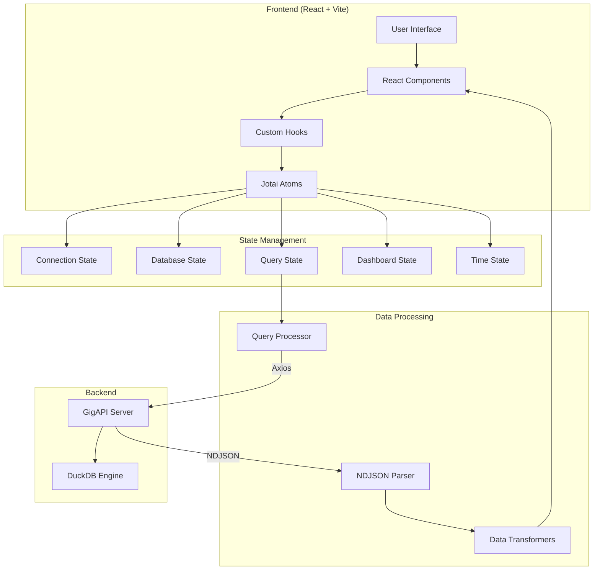
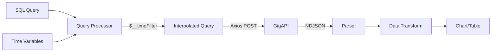

# GigAPI User Interface

GigAPI UI provides a slick web interface to query time-series using GigAPI Catalog Metadata + DuckDB

> [!WARNING]  
> GigAPI is an open beta developed in public. Bugs and changes should be expected. Use at your own risk.

## 🚀 Features

- **SQL Query Interface**: Monaco editor with syntax highlighting and autocomplete
- **Dashboard System**: Create and manage dashboards with multiple visualization panels
- **Real-time Data**: Query time-series data with automatic time variable interpolation
- **AI Integration**: Built-in chat interface for query generation and assistance
- **Multiple Visualizations**: Time series, bar charts, gauges, stats, tables, and more
- **Time Range Selection**: Flexible time range picker with relative and absolute options
- **Database Explorer**: Browse databases, tables, and schemas
- **Query History**: Track and reuse previous queries
- **Export Options**: Export query results in various formats

## 📋 Prerequisites

- Node.js 18+ and npm
- GigAPI server running (default: http://localhost:7971)
- Modern web browser (Chrome, Firefox, Safari, Edge)

## 🛠️ Installation

```bash
# Clone the repository
git clone https://github.com/yourusername/gigapi-ui.git
cd gigapi-ui

# Install dependencies
npm install

# Start development server
npm run dev

# Build for production
npm run build

# Preview production build
npm run preview
```

## 🔧 Configuration

The app stores all configuration in localStorage. On first launch, it will auto-detect the GigAPI server URL from your current location.

### Important Configuration Notes

⚠️ **NEVER use React.StrictMode** - It causes Monaco editor to flicker
⚠️ **String atoms require custom serialization** to avoid extra quotes in localStorage

## 🏗️ Architecture Overview



## 📁 Project Structure

```
src/
├── atoms/                 # Jotai state management
│   ├── connection/        # API connection state
│   ├── database-atoms.ts  # Database/table selection
│   ├── query-atoms.ts     # Query execution state
│   ├── dashboard-atoms.ts # Dashboard management
│   └── time-atoms.ts      # Time range state
├── components/            # React components
│   ├── ui/               # Base UI components (shadcn)
│   ├── query/            # Query interface components
│   ├── dashboard/        # Dashboard components
│   │   └── panels/       # Visualization panels
│   └── shared/           # Shared components
├── hooks/                # Custom React hooks
│   ├── usePanelQuery.ts  # Panel query execution
│   └── useDatabaseData.ts # Database data fetching
├── lib/                  # Utility functions
│   ├── query-processor.ts # SQL time variable processing
│   ├── parsers/          # Data parsers
│   │   └── ndjson.ts     # NDJSON parser
│   └── dashboard/        # Dashboard utilities
├── pages/                # Route pages
└── types/                # TypeScript definitions
```

## 🎯 Key Concepts

### State Management with Jotai

The entire app uses Jotai atoms (no React Context). Key atom patterns:

```typescript
// Base atom with localStorage persistence
export const apiUrlAtom = atomWithStorage("gigapi_api_url", "");

// Derived atom
export const isConnectedAtom = atom(
  (get) => get(connectionStateAtom) === "connected"
);

// Action atom
export const executeQueryAtom = atom(
  null,
  async (get, set, query: string) => {
    // Async logic here
  }
);
```

### Data Flow

1. **User Action** → Triggers atom update
2. **Atom Update** → Notifies subscribed components
3. **Component Re-render** → UI updates
4. **Side Effects** → Handled in action atoms (API calls)

### Query Processing Pipeline



### Time Variables

All queries support time variable interpolation:
- `$__timeFilter`: Adds WHERE clause for time range
- `$__timeField`: The selected time column name
- `$__timeFrom` / `$__timeTo`: Time range boundaries
- `$__interval`: Suggested GROUP BY interval

Example:
```sql
SELECT 
  $__timeField AS time,
  COUNT(*) as count
FROM my_table
WHERE $__timeFilter
GROUP BY time
```

## 🚦 Usage

### Basic Query

```sql
SELECT * FROM my_table WHERE $__timeFilter LIMIT 100
```

### Dashboard Creation

1. Navigate to Dashboards → New Dashboard
2. Set dashboard name and time settings
3. Add panels with the "Add Panel" button
4. Configure each panel:
   - Write SQL query
   - Select visualization type
   - Map fields to chart axes
5. Save dashboard (auto-saves to localStorage)

### Panel Types

- **Time Series**: Line/area charts for time-based data
- **Bar Chart**: Categorical or time-based bars
- **Stat**: Single value display
- **Gauge**: Progress visualization
- **Table**: Raw data display
- **Pie/Donut**: Distribution charts

## 🔌 API Communication

All API requests use Axios with two formats:

1. **System Queries** (JSON format):
```typescript
POST /query?db=mydb&format=json
{ "query": "SHOW TABLES" }
```

2. **Data Queries** (NDJSON format):
```typescript
POST /query?db=mydb&format=ndjson
{ "query": "SELECT * FROM table" }
```

## 🐛 Common Issues & Solutions

### Monaco Editor Blinking
- **Cause**: React.StrictMode double-mounting
- **Solution**: Never use StrictMode in main.tsx

### String Values with Extra Quotes
- **Cause**: JSON.stringify in atomWithStorage
- **Solution**: Use custom serialization for string atoms

### Panel Shows "No Data"
- Check query returns data in NDJSON format
- Verify field mapping in panel configuration
- Ensure time field is properly selected

### Connection Failures
- Verify GigAPI server is running
- Check localStorage has correct API URL
- URL format must be: `http://localhost:7971/query`

## 🚀 Performance Tips

1. Use `LIMIT` in queries during development
2. Select appropriate time ranges
3. Enable query result pagination for large datasets
4. Use the query history to avoid re-typing
5. Leverage dashboard panel caching

## 🤝 Contributing

1. Fork the repository
2. Create a feature branch (`git checkout -b feature/amazing-feature`)
3. Commit changes (`git commit -m 'Add amazing feature'`)
4. Push to branch (`git push origin feature/amazing-feature`)
5. Open a Pull Request

## 📄 License

MIT License - see LICENSE file for details

## 🔗 Links

- [Architecture Documentation](./RESUME.md) - Detailed technical documentation
- [GigAPI Backend](https://github.com/yourusername/gigapi) - The API server
- [DuckDB](https://duckdb.org/) - The analytical database engine